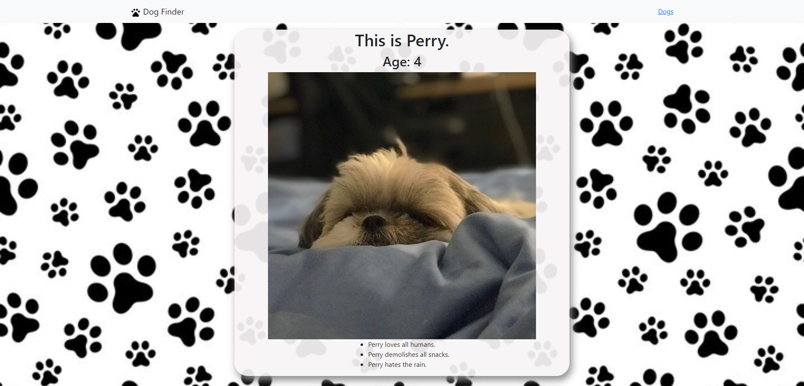

# React Router Dog Finder 

## Description: 

[Try me](https://pasha-log.github.io/dogs)

An application created with React Router's BrowserRouter, Switch, and Redirect

## Tools Used: 

* [React.js](https://reactjs.org/)
* [React Router](https://reactrouter.com/en/6.6.2/start/overview#feature-overview)
* [React Bootstrap](https://react-bootstrap.netlify.app/getting-started/introduction/)
